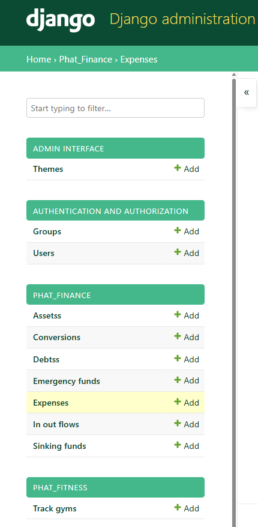
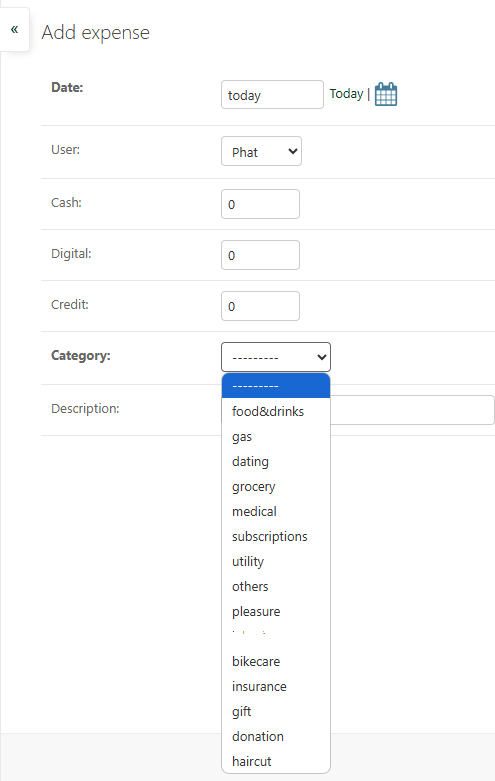
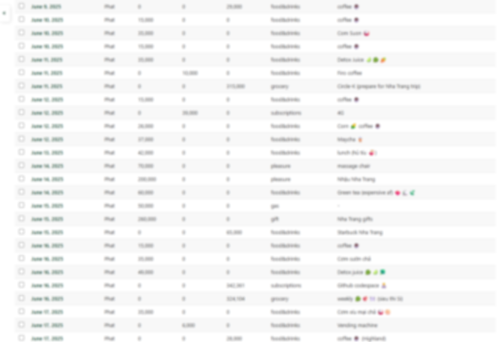
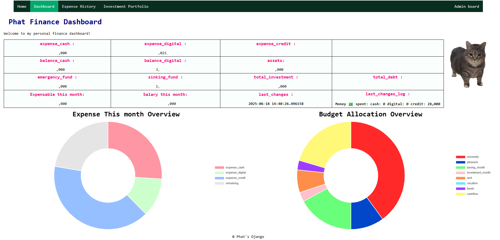

<head>
    <meta charset="UTF-8">
    <meta name="viewport" content="width=device-width, initial-scale=1.0">
</head>

# Phat_Django_Badass
> This is the Django backend to handle all the stuff in my life.
I meant from personal finance, investment, dividend income or my gym routine to other stuffs that requires data management.
I intended to build this not for my own usage only but for my family as well. User authentication and permission will be not a big deal tho

Here are some data models that I have implemented.
The Django built-in Admin board offer some powerful CRUD feature out of the box. So, less hassle for my side, yay.

django-admin-interface library also helps me alot to beautify the admin board since the default theme SUCKS

Some quick overview tho. I particularly have a keen for flurry images 👀

-----

<h1>Financial Dashboard</h1>
My personal financial dashboard to keep things up-to-date.

-----

<h1>Investment</h1>

Track my investment progress overtime, data input via Django admin model input form

## Tech used
I want to keep cost down so I try some free-tier services, which also get the job done (the user pool is small, to be hosnest 👀😏)

- Clouflare D1 databasse <-> SQLite 🛢️\
The main database is hosted using Clouflare D1, this is the most suitable SQL cloudbase I can find to be cost-effective and lightweight. Of course, the database needs to be ACID compliant, or else the whole transaction thingy will be pointless.

- Upstash Redis <-> Redis 🟥 \
Redis is a exellent key-value based database, suitable for rapidly update value like balances, expenses and my real-time financial dashboard

## Docker
I included a Dockerfile right here
