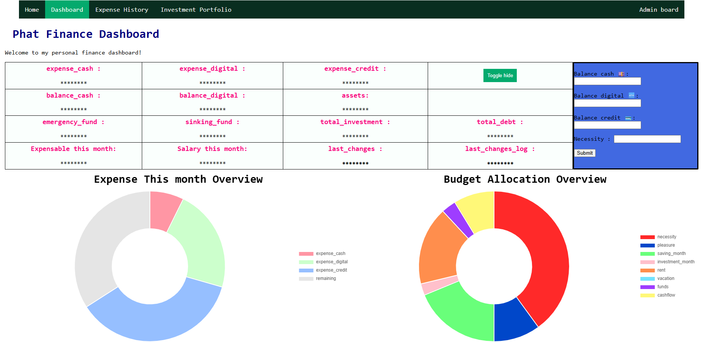
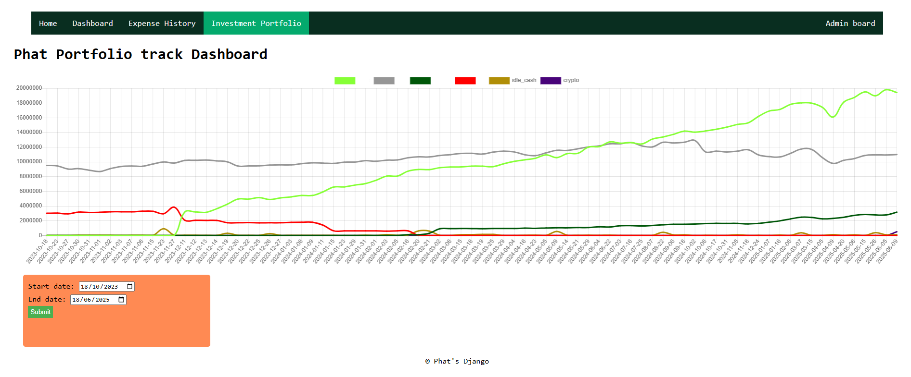

# Phat_Django_Badass
> This is the Django backend to handle all the stuff in my life.
I meant from personal finance, investment, dividend income or my gym routine to other stuffs that requires data management.
I intended to build this not for my own usage only but for my family as well. User authentication and permission will be not a big deal tho
-----

<h2>Financial Dashboard</h2>

My personal financial dashboard to keep things up-to-date

-----

<h2>Investment</h2>

Track my investment progress overtime, data input via Django admin model input form

## Tech used
I want to keep cost down so I try some free-tier services, which also get the job done (the user pool is small, to be hosnest 👀😏)

- Clouflare D1 databasse <-> SQLite 🛢️\
The main database is hosted using Clouflare D1, this is the most suitable SQL cloudbase I can find to be cost-effective and lightweight. Of course, the database needs to be ACID compliant, or else the whole transaction thingy will be pointless.

- Upstash Redis <-> Redis 🟥 \
Redis is a exellent key-value based database, suitable for rapidly update value like balances, expenses and my real-time financial dashboard

## Docker
`sudo docker build . --tag Phat_Django_Badass:<version>`
