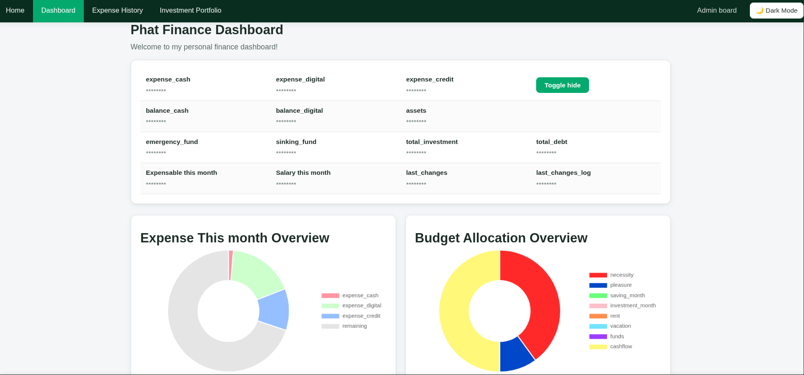
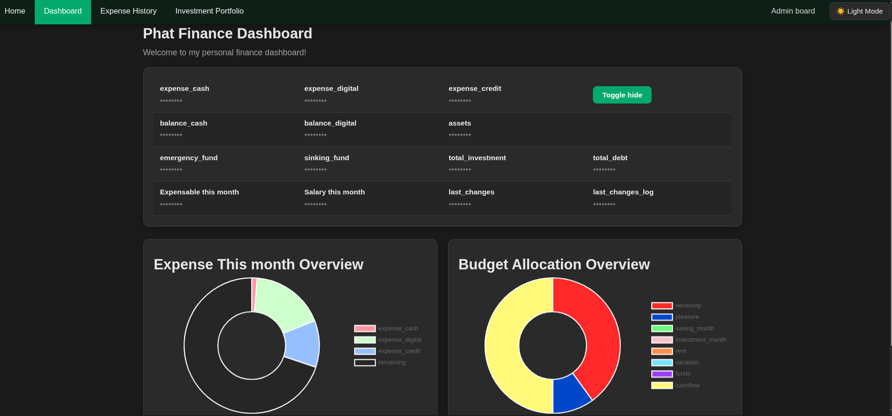
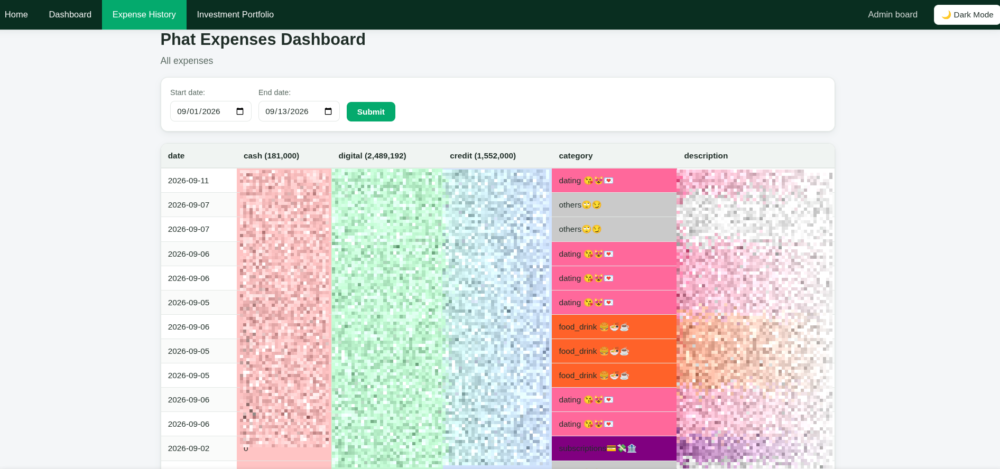

<p align="center">
  <h1 align="center">Phat_Django_Badass</h1>
  <p align="center">
    <b>Your personal command center for finance, investments, and life admin.</b><br>
    Built with Django. Designed for family-scale use.
  </p>
</p>

---

## About

This Django backend powers everything from personal finance, investments, and dividend income to gym routines and any other data-driven corners of life.

Originally built for myself and extended for my family, it comes with robust user authentication and permission management baked in from day one.

---

## Features

### Financial Dashboard
A clean, real-time dashboard to keep your personal finances up to date.

<p align="center">
  
  
</p>

### Expense Tracker
Visualize spending habits and expenses at a glance.

<p align="center">
  
</p>

### Investment Tracker
Track investment progress over time. Data is entered via Django's built-in admin interface.

<p align="center">
  
</p>

---

## Tech Stack

Kept lean and cost-effective — running on generous free-tier services that easily handle a small user pool (just family & friends 👀).

| Service | Role | Why It Fits |
|---------|------|-------------|
| **Django** | Backend & Admin | Python web framework for rapid, secure development |
| **Cloudflare D1** 🛢️ | Primary Database | Serverless SQLite — ACID compliant, lightweight, and cost-effective |
| **Upstash Redis** 🟥 | Caching & Real-time | Lightning-fast key-value store for balances, expenses, and live dashboard metrics |
| **Docker** 🐳 | Deployment | Consistent, portable environments across the board |

---

## Deployment

### Docker

Build the image manually:

```bash
sudo docker build . --tag Phat_Django_Badass:<version>
```

### Docker Compose (Recommended)

A `docker-compose.yml` is included to spin up the application together with an **Nginx** reverse proxy.

**1. Configure environment variables**

Create a `.env` file in the project root with the following variables:

```env
# Django
SECRET_KEY=your_secret_key_here
DEBUG=False

# Cloudflare D1 (SQLite)
ENGINE=your_db_engine
CLOUDFLARE_DATABASE_ID=your_database_id
CLOUDFLARE_ACCOUNT_ID=your_account_id
CLOUDFLARE_TOKEN=your_api_token

# Upstash Redis
UPSTASH_REDIS_USERNAME=your_redis_username
UPSTASH_REDIS_ENDPOINT=your_redis_endpoint
UPSTASH_REDIS_PORT=your_redis_port
UPSTASH_REDIS_PASSWORD=your_redis_password
UPSTASH_REDIS_REST_URL=your_redis_rest_url
UPSTASH_REDIS_REST_TOKEN=your_redis_rest_token
```

**2. Build and run**

```bash
docker compose up -d --build
```

- The app will be available at `http://localhost` (via Nginx on port `80`).
- Static files are automatically collected on startup.

**3. First-time setup (optional)**

If this is a fresh database, run migrations and create an admin account:

```bash
docker compose exec web python3 manage.py migrate
docker compose exec web python3 manage.py createsuperuser
```

**4. Stop the services**

```bash
docker compose down
```

---

## License

This project is licensed under the **MIT License** — feel free to use, modify, and distribute it as you see fit.
See [LICENSE](LICENSE) for full details.
